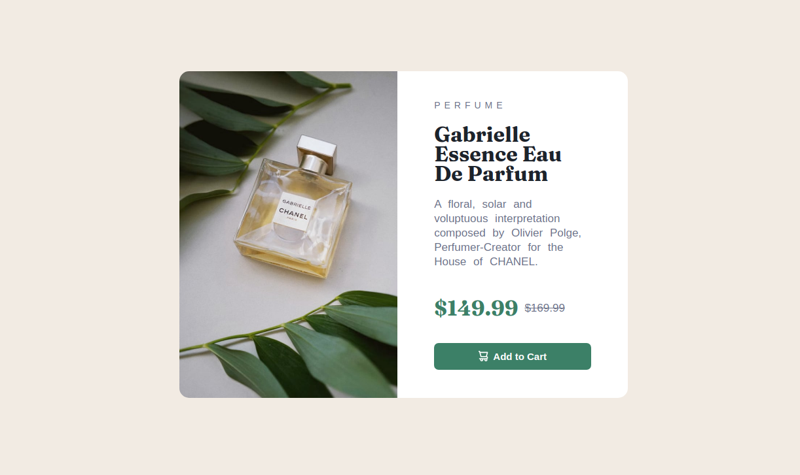

# Frontend Mentor - Product preview card component solution

This is a solution to the [Product preview card component challenge on Frontend Mentor](https://www.frontendmentor.io/challenges/product-preview-card-component-GO7UmttRfa). Frontend Mentor challenges help you improve your coding skills by building realistic projects. 

## Table of contents

- [Overview](#overview)
  - [The challenge](#the-challenge)
  - [Screenshot](#screenshot)
  - [Links](#links)
- [My process](#my-process)
  - [Built with](#built-with)
  - [What I learned](#what-i-learned)
  - [Continued development](#continued-development)
- [Author](#author)

## Overview

### The challenge

Users should be able to:

- View the optimal layout depending on their device's screen size
- See hover and focus states for interactive elements

### Screenshot



### Links

- Live Site URL: [Add live site URL here](https://your-live-site-url.com)

## My process

When you are faced with a challenge like this, you must always start encapsulating things.
Learning the Box Model really helps to keep an abstract idea of how to arrange the elements.

In this challenge, I went the desktop design first route, by looking at provided design, and tried to figure out what is the biggest container.
And from there look for the  direct childs of that container.
Repeating the process on a recursive way.

When I got the full image, all goes smooth.
   Write the tags,
   Add the classes,
   And then style!

From there, i can only say that make the design responsive its more difficult that it seems..

### Built with

- Semantic HTML5 markup
- CSS custom properties
- Flexbox
```

### Continued development

CSS has always been the most difficult in my learning path through Web Development.
Nevertheless, i'm going to keep pushing forward.
This is my first serious CSS Proyect, and by now I can already tell that I'm just seeing the tip of the iceberg.
Keep grinding, future self!

## Author

- Website - [Add your name here](https://www.your-site.com)
- Frontend Mentor - [@WillAvatec](https://www.frontendmentor.io/profile/WillAvatec)
